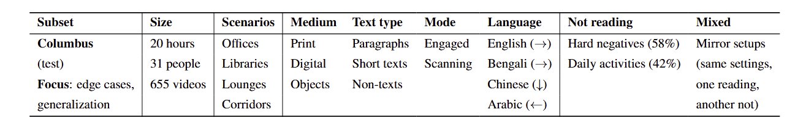
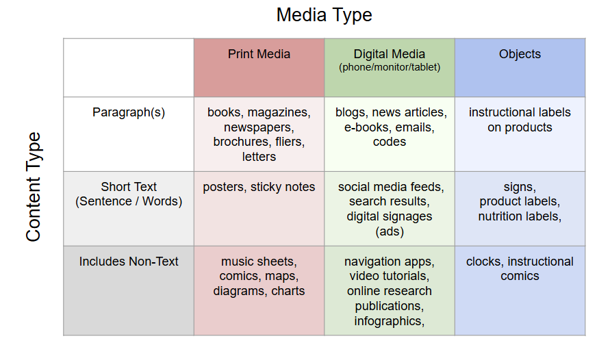
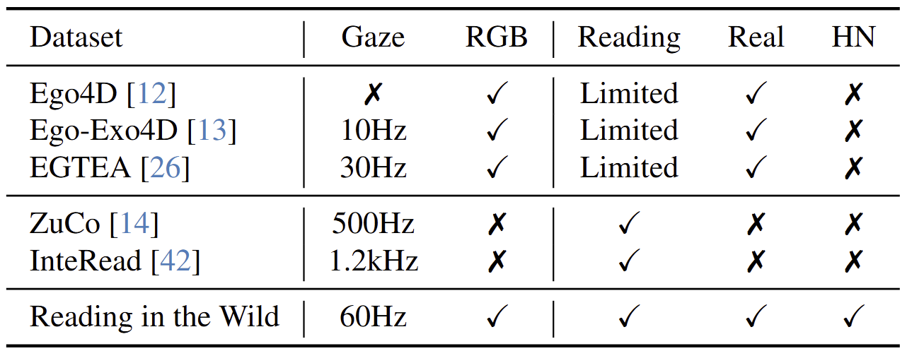
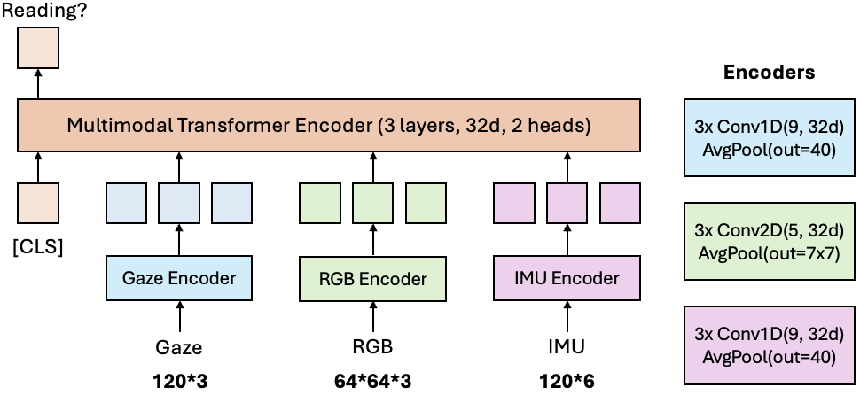

# Reading in the Wild Dataset - Columbus Subset

# Introduction
”Reading in the Wild” dataset is the first-of-its-kind large-scale multimodal dataset collected using Meta's smart glasses under Project Aria. The dataset contains 100 hours of reading and non-reading egocentric videos in diverse and realistic scenarios. It also includes eye gaze and head pose data collected during reading and non-reading activities. The dataset can be used to develop models not only for identifying reading activities but also for classifying different types of reading actvities in real-world scenarios. 

The dataset contains two subsets -- Seattle subset and Columbus subset. This repository is for the Columbus subset. The Seattle subset is maintained separately [here](https://github.com/facebookresearch/reading_in_the_wild).

## Overview of Columbus Subset

<p align="center">

</p>

The Columbus subset contains around 20 hours of data from 31 subjects containing reading and non-reading activities in indoor scenarios. It is collected with the objective for zero-shot experiments. It contains examples of hard negatives (where text is present but is not being read), searching/browsing (which gives confusing gaze patterns), and reading non-English texts (where reading direction differs).
<p align="center">

</p>

As summarized in the following chart, the Columbus subset contains data collected from reading across three different medium types including digital, print, and objects. It also contains data collected from reading across three different types of contents, including paragraphs which have long continuous text, short texts such as posters and nutrition labels, and non-textual content such as illustrative diagrams. 

<p align="center">

</p>

## Comparison to Existing Datasets
Compared to existing gocentric video datasets as well as reading datasets, our dataset is the first reading dataset that contains high-frequency eye-gaze, diverse and realistic egocentric videos, and hard negative (HN) samples. 
<p align="center">

</p>

## Models
A base model (`v1_default`) trained on the training data of the Seattle subset can be 
found [here](https://github.com/facebookresearch/reading_in_the_wild). 
The model uses a 5&deg; FoV RGB crop (64x64) from the RGB camera of the glasses centered on the wearer's eye gaze, 3D gaze 
velocities sampled at 60Hz spanning 2s from the eye tracking cameras and 3D head orientation and velocity sampled at 
60Hz spanning 2s from the IMU sensors. The model can selectively work with any combination of these three modalities. 
<p align="center">

</p>

Besides the base model, the following variants are also provided [here](https://github.com/facebookresearch/reading_in_the_wild):
+ `v1_1s`: uses a shorter 1s span for Gaze data
+ `v1_15Hz`: uses a lower 15Hz sampling frequency for Gaze data
+ `v1_large`: uses a larger RGB crop size of 128x128
+ `v1_medium`: outputs categorical predictions for medium (`no-read`, 'print`, 'digital` and `objects`).
+ `v1_mode`: outputs categorical predictions for reading modes(`no-read`, 'walk`, 'out-loud`, `engaged`, `scan`, 
`write/type` and `skim`).

For details of the base model and its variants, please refer to [here](https://github.com/facebookresearch/reading_in_the_wild). 

# Getting Started
## Setup
Use conda to create a new environment and install the required packages. The codebase has been tested with Python 3.12 and PyTorch 2.4.
```commandline
conda env create -f environment.yml
```
Once the environment is created, activate it:
```commandline
conda activate ritw-osu
```

## Download

### Dataset
The dataset is hosted at Huggingface Hub in this [page](https://huggingface.co/datasets/OSU-AIoT-MLSys-Lab/Reading-in-the-Wild-Columbus). To download please run:
```commandline
python -m ritw.download
```
This will save the dataset in `dataset` folder.

### Models
Download the models from [here](https://github.com/facebookresearch/reading_in_the_wild) and put them inside the ```models/``` folder.

## Inference
The inference pipeline is configurable via a config file. An example config is shown below: 
```yaml
# Example: ../config/config.yaml
# conf/config.yaml
start_time: 0.0
snippet_gap: 0.01667  # roughly 1/60 seconds
mode: "folder" # folder/single. If mode is single, please provide input_filename in config. If mode is folder, inference will be done on all files in root dir.
modalities:
  - "gaze"
  - "imu"
  - "rgb"
  - "gaze+rgb"
  - "gaze+imu"
  - "imu+rgb"
  - "gaze+imu+rgb"
output_save_path: "output/"
root_dir: "/path/to/ritw/dataset/"
model_name:
  - "v1_default"
  - "v0"
num_workers: 4  # adjust based on available CPU cores
```
The config allows selecting modalities and models to infer on. Note that, to add new models, put the model in the `ritw-osu/models` directory and add the model name to the config file.

To run prediction, create a config.yaml file (also see `predict.yaml` for reference) and save to `ritw-osu/config`. Then use the following command:
```bash
python -m ritw.predict --config-name config.yaml
```
The command runs each file and model combinations in separate processes. The output is saved in the form of `csv` files in directory `<output_save_path>/<model_name>`. 

## Evaluation
The evaluation module allows you to benchmark the performance of the models based on the inference results. It utilizes metadata from the recordings, applies configurable filters to focus on a specific subset of the dataset, computes various performance metrics for each modality, and outputs a summary table in Markdown format.

Below is an example configuration file (`conf/config.yaml`) for the evaluation module:

```yaml
# Example: ../config/config.yaml
metadata_file: "data/metadata.csv"
result_dir: "output/v1_default"
target_recall: 0.9
metrics:
  - "F1"
  - "Acc"
  - "P@R=0.9"
  - "T@R=0.9"
  - "Acc@R=0.9"
  - "F1@R=0.9"
  - "AUC"
modalities:
  - "gaze"
  - "rgb"
  - "imu"
  - "gaze+imu"
  - "imu+rgb"
  - "gaze+rgb"
  - "gaze+imu+rgb"
filters:
  ContainsNonText:
    - "images"
  ShortTextOrPara:
    - "paragraphs"
  Medium:
    - "digital"
  Platform:
    - "laptop"
```

After setting up your environment and ensuring that the metadata and prediction CSV files are available, run the evaluation module from the project’s root directory:
```bash
python -m ritw.evaluate --config-name config.yaml
```
